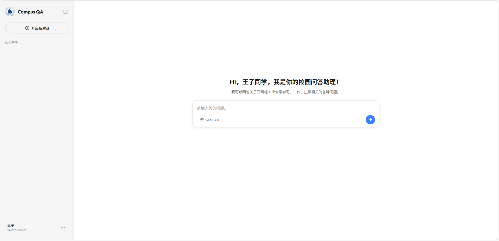
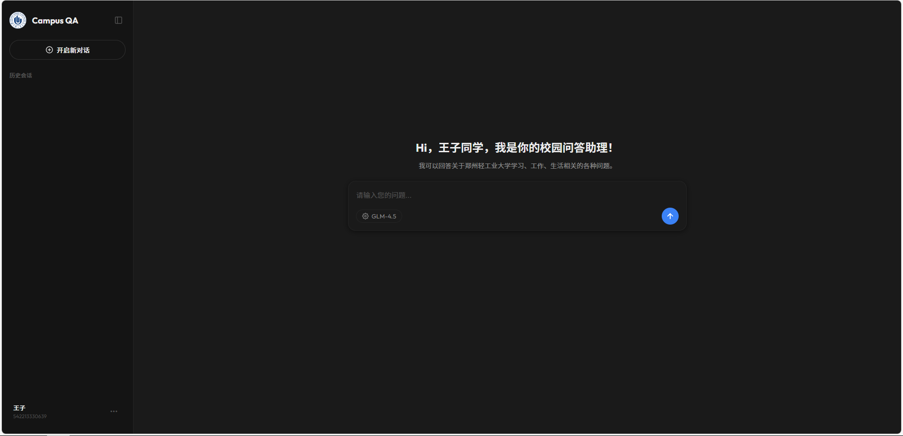
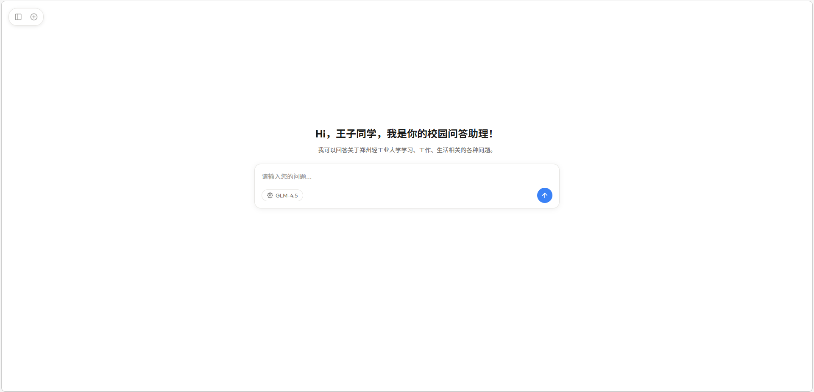
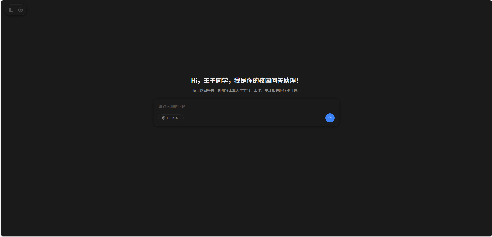
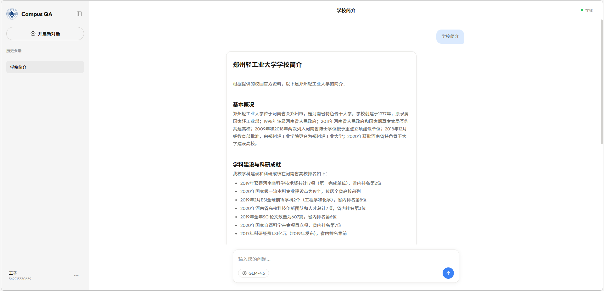
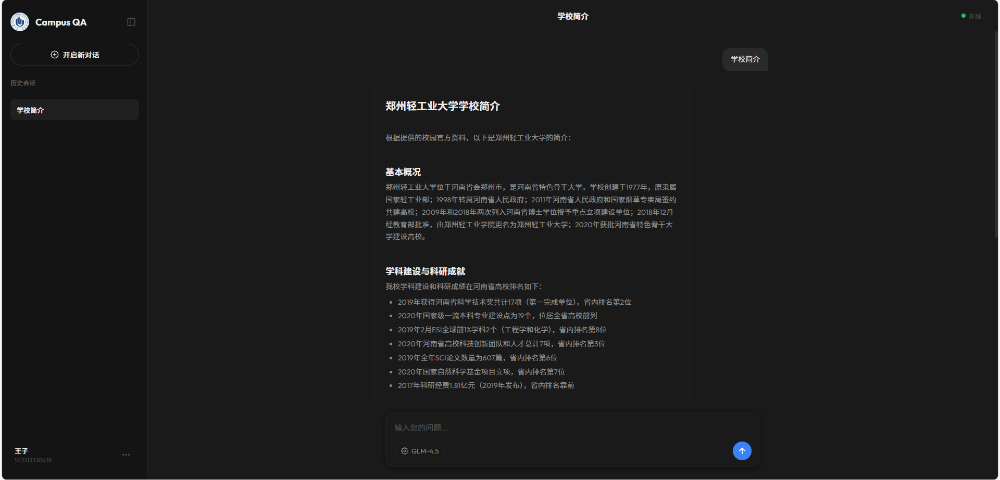

# 基于 LangChain + Milvus 的校园知识库智能问答系统

> 郑州轻工业大学软件工程专业毕业设计
> **课题名称**：基于 LangChain + Milvus 的校园知识库智能问答系统的设计与实现
> **指导教师**：甘琤


---

## 📖 项目简介

**针对校园政策查询繁琐、信息分散的问题**，本系统整合教务规则、学生手册等资料，实现精准高效检索，为师生提供便捷信息服务，提升校园管理信息化水平。

本系统采用 **RAG（Retrieval-Augmented Generation）** 架构，基于 LangChain 框架 + Milvus 向量数据库 + MySQL 结构化存储，实现结构化教务数据与非结构化文档的**双源融合检索**。已完成端到端开发，支持 Web 可视化交互，功能稳定、检索准确，可为同类校园智能问答系统提供参考方案。

---

## 📚 目录

1. [主要功能](#-主要功能)
2. [技术栈](#-技术栈)
3. [快速开始](#-快速开始)
4. [系统截图](#-系统截图)
5. [项目结构](#-项目结构)
6. [项目意义](#-项目意义)
7. [作者](#-作者)

---

## ✨ 主要功能

- **自然语言智能问答**：支持"缓考流程是什么？"、"奖学金评定条件"、"学校简介"等校园相关问题
- **双源检索机制**：MySQL 精准查询结构化教务规则 + Milvus 向量相似性检索非结构化资料（PDF/Word/Excel）
- **RAG 完整流程**：文档解析 → 向量入库 → 双源检索融合 → Prompt 工程 → 大模型生成
- **现代 Web 界面**：支持浅色 / 暗黑模式切换，侧边栏历史会话与快捷入口
- **数据自动处理**：支持 Excel、Word、PDF 校园资料自动解析与入库
- **Docker 一键部署**：Milvus + MySQL + FastAPI 全部容器化
- **异常兜底**：无检索结果、网络异常均有友好提示

---

## 🛠 技术栈

| 层级 | 技术 |
|------|------|
| 后端框架 | Python + FastAPI |
| AI 框架 | LangChain（RAG 管道） |
| 向量数据库 | Milvus 2.6.x（Docker 部署） |
| 结构化数据库 | MySQL 8.0+ |
| 大模型接入 | OpenAI 兼容接口 / 本地量化模型 |
| 前端 | HTML + CSS + JavaScript（`static/` 目录） |
| 文档解析 | PDF、Word、Excel |
| 部署 | Docker + Docker Compose |

---

## 🚀 快速开始

> 完整运行说明请参阅 [run_guide.md](./run_guide.md)

### 1. 克隆仓库

```bash
git clone https://github.com/Kamine-Jf/CampusKnowledge_QASystem.git
cd CampusKnowledge_QASystem
```

### 2. 环境准备

- 安装 [Docker](https://www.docker.com/) 和 Docker Compose
- 安装 Python 3.10 / 3.11，创建虚拟环境并安装依赖：

```bash
python -m venv .venv
# Windows
.venv\Scripts\activate
# Linux / macOS
source .venv/bin/activate

pip install -r requirements.txt -i https://pypi.tuna.tsinghua.edu.cn/simple
```

- （可选）在项目根目录创建 `.env` 文件，填入大模型 API Key：

```env
OPENAI_API_KEY=your_api_key_here
OPENAI_BASE_URL=https://api.openai.com/v1
```

### 3. 启动基础服务

```bash
docker-compose up -d --build
```

### 4. 访问系统

打开浏览器访问 `http://localhost:8000`（端口以 `docker-compose.yml` 配置为准）。

| 地址 | 说明 |
|------|------|
| `http://localhost:8000` | Web 问答主界面 |
| `http://localhost:8000/docs` | Swagger API 文档 |
| `http://localhost:8000/health` | 健康检查接口 |

---

## 📸 系统截图

| 浅色模式 | 暗黑模式 |
|----------|----------|
|  |  |
|  |  |
|  |  |

---

## 📁 项目结构

```
CampusKnowledge_QASystem/
├── main.py                 # FastAPI 项目入口
├── requirements.txt        # Python 依赖（主）
├── requirements_stage4.txt # 量化大模型额外依赖
├── docker-compose.yml      # Docker 部署配置
├── Dockerfile              # 镜像构建文件
├── run_guide.md            # 详细运行指南
├── src/                    # 核心源码（RAG 管道、检索逻辑）
├── static/                 # 前端静态资源（HTML/CSS/JS）
├── config/                 # 日志等全局配置
├── data/                   # 校园资料（PDF/Word/Excel）
├── docs/                   # 文档
├── test/                   # 测试脚本
└── logs/                   # 运行日志输出目录
```

---

## 🎯 项目意义

- **实践意义**：为郑州轻工业大学师生提供 7×24 小时智能校园咨询服务，减轻人工负担
- **理论意义**：验证 LangChain + Milvus 在轻量级校园 RAG 系统中的可行性
- **应用价值**：可扩展至其他高校，提供标准化校园知识库智能问答方案

---

## 👤 作者

| 项目 | 信息 |
|------|------|
| 姓名 | 谢嘉峰（Kamine） |
| 学号 | 542213330641 |
| 专业 | 软件工程 |
| 指导教师 | 甘琤 |
| 学校 | 郑州轻工业大学 |

---

欢迎 Star ⭐、Issue 与 PR，一起完善校园智能问答系统！

**项目链接**：[https://github.com/Kamine-Jf/CampusKnowledge_QASystem](https://github.com/Kamine-Jf/CampusKnowledge_QASystem)
